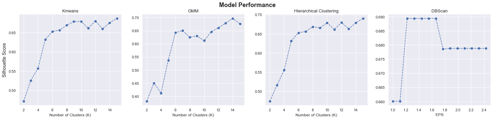
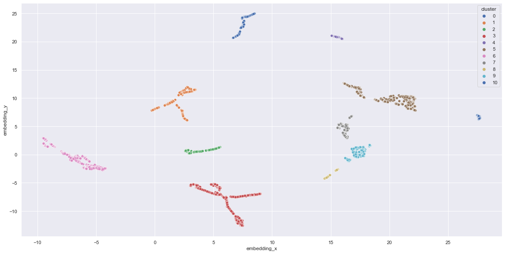
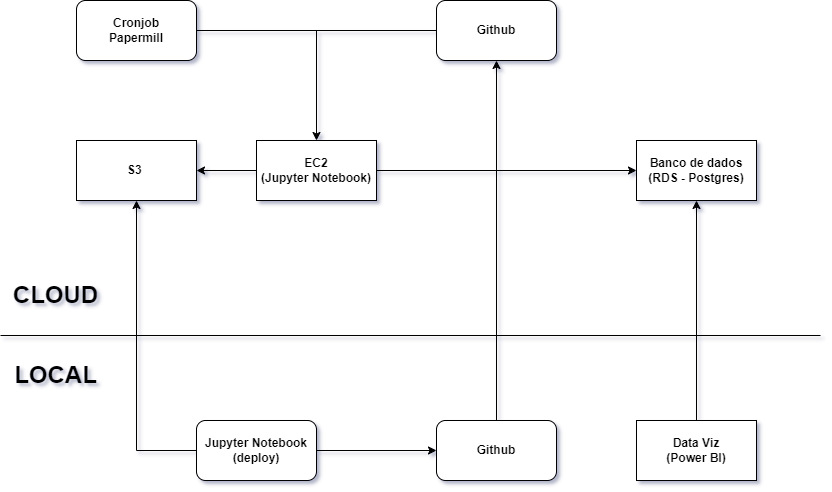

# Programa Insiders - Fidelização de Clientes
 

## 1. Problema de negócio
Um outlet multimarcas que comercializa produtos de segunda linha por meio de um e-commerce, percebeu que ao longo do tempo alguns de seus clientes compram produtos mais caros e com alta frequência. Eles são responsáveis por impactar significativamente o faturamento da empresa.

Com base nessa percepção, a empresa decidiu segmentar os clientes de acordo com o perfil de consumo e criar um programa de fidelidade chamado de "Insiders". Essa segmentação deverá tornar a empresa mais acertiva em suas ações de marketing,  visando atingir clientes com perfil similar.

### 1.1 Objetivo
Agrupar os mais de 5000 clientes em grupos por perfil de consumo, e identificar os clientes mais valiosos. Ao final do projeto, um relatório será entregue contendo análise e respondendo as seguintes perguntas de negócio:

* Quem são as pessoas elegíveis para participar do programa de Insiders?
* Quantos clientes farão parte do grupo?
* Quais as principais características desses clientes?
* Qual a porcentagem de contribuição do faturamento, vinda dos Insiders?
* Qual a expectativa de faturamento desse grupo para os próximos meses?
* Quais as condições para uma pessoa ser elegível ao Insiders ? E para ser removida ?
* Qual a garantia que o programa Insiders é melhor que o restante da base?
* Quais ações o time de marketing pode realizar para aumentar o faturamento?

## 2. Descrição dos dados
Os [dados](https://www.kaggle.com/datasets/carrie1/ecommerce-data) que foram disponibilizados pela empresa contém informações das compras realizadas entre o período de Nov 2016 - Dez 2017 conforme atributos abaixo:

|Atributo|Definição|
|--------|---------|
|InvoiceNo| Número de identicação da fatura|
|StockCode| Código de estoque único referente ao produto comprado|
|Description| Descrição do produto|
|Quantity| Quantidade de itens comprados (ou devolvidos em caso de valores negativos)|
|InvoiceDate| Data da emissão da fatura|
|UnitPrice| Preço unitário do produto|
|CustomerID| Código de identificação único do cliente que realizou a compra|
|Country| País onde a compra foi realizada|

## 3. Planejamento da solução
O planejamento da solução foi divido em três etapas:

### 3.1 Produto Final
O produto final será uma lista com os clientes agrupados, gerando o Programa Insiders, e um relatório respondendo as perguntas de negócio. Além disso, será criado um sistema em produção para classificação de novos clientes, que serão inseridos em um banco de dados Postgres na AWS (RDS) para visualização através de dashboards online e localmente utilizando o Power BI.

### 3.2 Ferramentas

* Python 3.10.4
* Visual Studio Code
* Git e Github
* SQL com SQLite e PostgreSQL
* Serviços AWS: S3 (armazenamento), EC2 (servidor) e RDS (banco de dados)
* Algoritmos de Clusterização(K-Means, Gaussian Mixture Model, Hierarchical Clustering e DBSCAN)
* Técnicas de Embedding ( PCA, t-SNE e UMAP/Random Forest )
* Crontab e Papermill;
* Power BI Desktop

### 3.3 Processos

**3.1.1 Entendimento do negócio:** Nessa etapa inicial é fundamental identificar os objetivos do negócio e entender como a empresa atua no mercado.

**3.1.2 Descrição dos dados:** Coletar os dados e compreender o significado de cada atributo dos interessados. Utilizar métricas estatísticas para fornecer uma visão geral, renomear colunas, identificar e tratar dados nulos e duplicados, padronizar os tipos dos dados. Durante a análise 

**3.1.3 Filtragem dos dados:** Filtrar dados de acordo com análise da estatística descritiva.

**3.1.4 Feature engineering:** Foram criados novos atributos com intuito de melhor compreender o comportamento dos clientes.

**3.1.5 Análise Exploratória de Dados (EDA):**

- Análise Univariada: Analisar as variáveis individualmente verificando possíveis outliers inconsistentes, a fim de filtrá-los ao longo dos próximos ciclos.

- Análise Bivariada: Observar a variância entre as variáveis.

- Matriz de Cohort: Observar a taxa de retenção de clientes ao longo do período.

**3.1.6 Seleção de atributos:** Selecionar os atributos com maior variabilidade e que fazem sentido para o negócio, visando melhorar a performance dos modelos.

**3.1.7 Preparação dos dados:** Aplicar transformações nas features, facilitando o aprendizado dos modelos.

**3.1.8 Estudo do espaço:** Realizar um estudo do espaço dos dados aplicando técnicas de rredução de dimensionalidade.

**3.1.9 Hyperparameter Fine Tuning:** Experimentação de modelos de clusterização com diferentes K (quantidade de grupos), no espaço de features e no espaço de embedding. Determinar melhor modelo e quantidade de grupos que tenham melhor performance (SS Score e Análise de Silhueta) e que estejam alinhados com a regra de negócio.

**3.1.10 Machine Learning Modeling:** Executar o algoritmo com a melhor performance determinado na etapa de Fine Tuning.

**3.1.11 Análise Exploratória dos Clusters:** Análise final dos clusters gerados e uso dos dados para responder as perguntas do time de marketing e gerar Insights para o negócio.

**3.1.12 Deploy modelo em produção:**

- Relatório com os resultados obtidos.
- Modelo em produção para classificação de novos clientes.
- Dashboards em Power BI para acompanhameto do programa.

## 4. Modelos de Machine Learning

### 4.1 Métricas

Silhouette Score (SS): Métrica utilizada para avaliar a qualidade dos clusters, ela mede o quão bem os objetos estão agrupados, com base na distância média entre os objetos no mesmo cluster e a distância média aos objetos de clusters vizinhos. Ela varia de -1 a 1 onde :

- **próximo de +1:** valor ideal, indica que os objetos estão bem agrupados, com uma separação clara entre os clusters 

- **próximo de 0 :** Indica que os objetos estão próximos ou sobrepostos a fronteira dos clusters.

- **próximo de -1:** Indica que os objetos podem estar atribuídos aos clusters errados.

 
Fórmula:
 

 

$$ \text{Silhouette Score} = \frac{b - a}{\max(a, b)} $$

​ 
- a - distância média intra-cluster

- b - distância média do cluster mais próximo 

### 4.2 Modelos e estudo de espaço

Para esse projeto foram utilizados os seguintes modelos de clusterização:

- K-Means
- GMM ( Gaussian Mixture Model )
- HC ( Hierarchical Clustering )
- DBScan ( Density-Based Spatial Clustering of Applications with Noise )

Afim de melhorar o espaço dos dados foram utilizadas as seguintes técnicas de redução de dimensionalidade:

- PCA (Principal Component Analysis)
- UMAP (Uniform Manifold Approximation and Projection)
- t-SNE (t-Distributed Stochastic Neighbor Embedding)
- Random Forest/UMAP (Tree-Based Embedding) foi utilizado como variável alvo o atributo "Gross Revenue"

A técnica de Tree-based Embedding foi a que apresentou os melhores resultados. Assim, com o espaço gerado foram treinados os 4 modelos, variando o número de grupos (k) entre 2 e 15 para os 3 primeiros modelos. 

Para o DBScan não é necessario informar o número de K, pois ele calcula com base na densidade dos pontos em seu espaço. Foi utilizado 2 parâmetros para que fosse possível essa análise.

- Min_samples: Determina o número mínimo de vizinhos que um ponto precisa para formar um cluster ( fixado esse valor em 30 ).
- EPS (Epsilon): Define a distância máxima que um ponto pode estar de outro ponto para ser considerado parte do mesmo cluster ( variando de 1 a 2,5).

### 4.3 Performance

A performance dos modelos foi medida com a métrica SS (Silhouette Score), visto que ela é aplicável a todos os modelos de clusterização testados.

Os melhores resultados foram :

 

|Modelo | Nº Clusters | Silhouette Score |
|------ |-------------|------------------|
|K-Means| 15          | 0.686689         |
|GMM    | 14          | 0.697028         |
|HC     | 15          | 0.690170         |
|DBScan | 11          | 0.689405         |

 

 

Por uma estratégia alinhada com o negócio o modelo final escolhido foi o DBScan que apresentou uma performance muito boa com o menor número de clusters. O melhor resultado foi obtido no espaço de embedding gerado através de Random Forest/UMAP (Tree-Based Embedding) e pode ser visualizado conforme abaixo :

#### Inspeção visual

#### Cluster profile

 

## 5. Deploy do modelo

Para deploy do modelo foram utilizados serviços da cloud AWS (Amazon Web Service) conforme etapas abaixo:

- Criado um Bucket S3 na AWS para armazenar os dados dos clientes
- Criado um banco de dados Postgres com o AWS RDS, onde os dados já tratados e agrupados serão armazenados
- Instanciado um ambiente Linux AWS EC2, que por meio das bibliotecas 'papermill' e 'cronjob', executará o notebook para que a análise dos clusters seja constantemente atualizada e a movimentação dos clientes entre os clusters seja observada.

#### Infraestrutura do Projeto:

 

Com o modelo implementado, foram gerados: o [Relatório](reports/report.pdf) respondendo as perguntas de negócio, uma [lista](reports/clusters.csv) com os clientes classificados para o programa e uma versão estática do [Dashboard](img/dashboard_pwbi.png) construido com Power BI para visualizar o comportamento dos clusters.

## 6. Conclusão

O objetivo deste projeto foi segmentar os clientes de acordo com o perfil de consumo e identificar os consumidores mais valiosos para a empresa. Com isso a empresa pode oferecer benefícios personalizados e aumentar a fidelidade desses clientes.

Foram criados 11 clusters, sendo o principal deles o cluster "Insider". Esse grupo é composto por 332  clientes, representando 7,7% da base total de clientes, ele é responsável por 50,6% do faturamento total da empresa.

Através desse agrupamento, os times de negócios podem iniciar campanhas mais precisas para cada grupo em específico, visando aumentar a fidelidade desses clientes e evitando assim uma futura evasão ou diminuição do ritmo de compras. 

Com a solução de dados entregue, a empresa possui agora um programa de fidelidade robusto e lucrativo.

## 7. Próximos Passos

- Categorizar os produtos para melhor coompreensão no comportamento dos clientes.
- Criar uma regra para que nao seja possível efetuar compra sem o cadastro do cliente afim de zerar as compras sem identificação.
- Criar novas features para melhorar o modelo.
- Automatizar o processo de criação de clusters.
- Testar outros algoritmos de clusterização.